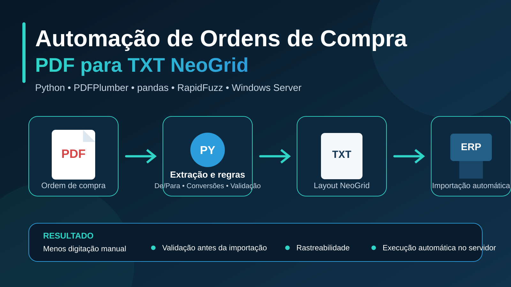

<p align="center">
  
</p>

<h1 align="center">Automação de Ordens de Compra</h1>

<p align="center">
  Conversão automática de ordens de compra em PDF para arquivos TXT no padrão NeoGrid, com validações, regras comerciais e execução em servidor Windows.
</p>

<p align="center">
  
  
  
  
  
</p>

## Visão geral

Este projeto automatiza o tratamento de ordens de compra recebidas em PDF e gera arquivos TXT compatíveis com o layout NeoGrid para importação no ERP.

A solução foi criada para reduzir digitação manual, padronizar conversões comerciais, bloquear arquivos inconsistentes e manter rastreabilidade de cada processamento.

O fluxo já está preparado para operação automática em servidor Windows por meio do Agendador de Tarefas.

## Problema de negócio

O processo manual de importação de pedidos exige leitura do PDF, identificação dos produtos, conversão de unidades, conferência de valores e digitação no ERP. Esse processo apresenta riscos como:

- erros de digitação;
- produtos associados ao código incorreto;
- divergências entre unidade comprada e unidade cadastrada no ERP;
- perda de tempo em pedidos repetitivos;
- dificuldade de auditar conversões e falhas;
- importação de arquivos incompletos ou inconsistentes.

## Solução desenvolvida

```text
Ordem de compra em PDF
        ↓
Extração do conteúdo
        ↓
Interpretação do pedido
        ↓
De/Para de produtos
        ↓
Conversões comerciais
        ↓
Validações de segurança
        ↓
TXT no padrão NeoGrid
        ↓
Importação no ERP
```

## Principais entregas

| Etapa | Entrega |
|---|---|
| Extração | Leitura de PDFs com `pdfplumber` |
| Interpretação | Identificação de cabeçalho, itens, quantidades, valores e totais |
| De/Para | Correspondência exata e aproximada com a tabela de produtos do ERP |
| Conversões | Ajuste de quantidades, embalagens e valores unitários |
| Validação | Bloqueio de itens não encontrados, casos para revisão e divergências |
| Saída | Geração do TXT NeoGrid e de relatórios de processamento |
| Operação | Execução manual, em lote ou automática no servidor |

## Regras de negócio implementadas

A automação contempla diferentes regras comerciais, incluindo:

- divisão por embalagem com arredondamento para cima;
- arredondamento para múltiplos fechados;
- conversão de unidade comercial;
- ajuste do valor unitário após conversão;
- recálculo do valor total;
- regras específicas por produto;
- tratamento de duplicatas na tabela de produtos;
- suporte a mais de uma ordem de compra no mesmo PDF.

Exemplos de conversão:

| Situação | Resultado |
|---|---|
| 130 unidades com embalagem de 50 | 3 caixas |
| 151 unidades com embalagem de 150 | 2 caixas |
| 90 unidades com múltiplo de 72 | 144 unidades |
| 12 kg em embalagens de 5 kg | 3 pacotes |

## Correspondência de produtos

O item extraído do PDF é comparado com a tabela de produtos do ERP.

O processo utiliza:

1. normalização dos textos;
2. correspondência exata;
3. correspondência aproximada com `RapidFuzz`;
4. aplicação das regras de conversão;
5. classificação do resultado.

### Status possíveis

| Status | Significado |
|---|---|
| `encontrado_exato` | Produto localizado diretamente |
| `encontrado_aproximado` | Correspondência aproximada considerada segura |
| `revisar` | Há uma possível correspondência, mas exige conferência humana |
| `nao_encontrado` | Produto não foi localizado com segurança |

O TXT somente é liberado quando todos os itens estão aprovados para processamento.

## Validações

Antes da geração do arquivo final, o sistema valida:

- presença de todos os produtos;
- ausência de itens pendentes de revisão;
- ausência de itens não encontrados;
- consistência entre os valores calculados e o total da ordem;
- estrutura mínima dos registros do TXT;
- estabilidade do arquivo antes do processamento no servidor;
- existência dos arquivos de apoio necessários.

## Arquivo TXT NeoGrid

O módulo de saída monta os registros exigidos pelo layout utilizado no projeto:

- `019` — identificação do pedido;
- `024` — dados complementares;
- `040` — itens do pedido;
- `090` — fechamento do arquivo.

Os arquivos finais seguem o padrão:

```text
OC_<numero_da_ordem>.txt
```

## Relatórios gerados

| Arquivo | Finalidade |
|---|---|
| `relatorio_conversao_OC_<numero>.xlsx` | Auditoria item a item das conversões |
| `produtos_unicos.xlsx` | Tabela de produtos tratada |
| `produtos_duplicados_para_revisao.xlsx` | Casos conflitantes que exigem análise |
| Logs da automação | Registro das execuções e falhas |

## Tecnologias utilizadas

| Tecnologia | Aplicação |
|---|---|
| Python | Orquestração da automação |
| pandas | Tratamento e transformação dos dados |
| openpyxl | Leitura e geração de arquivos Excel |
| pdfplumber | Extração de conteúdo dos PDFs |
| RapidFuzz | Correspondência aproximada de produtos |
| python-dotenv | Configuração por variáveis de ambiente |
| pytest | Testes automatizados |
| Windows Task Scheduler | Execução automática no servidor |

## Estrutura do projeto

```text
silo-automacao/
├── assets/
├── data/
│   ├── entrada/
│   │   └── ordens_pdf/
│   ├── saida/
│   │   ├── txt_gerados/
│   │   └── relatorios/
│   ├── apoio/
│   └── exemplos/
├── docs/
├── src/
│   ├── auto_processar_pasta.py
│   ├── config.py
│   ├── extrair_pdf.py
│   ├── gerar_txt_neogrid.py
│   ├── main.py
│   ├── parser_oc.py
│   ├── produtos_depara.py
│   ├── relatorio_processamento.py
│   ├── tratar_duplicatas.py
│   └── validar_txt.py
├── tests/
├── .env.example
├── requirements.txt
├── rodar_automacao_oc.bat
└── README.md
```

## Módulos principais

| Módulo | Responsabilidade |
|---|---|
| `extrair_pdf.py` | Extrair o conteúdo bruto do PDF |
| `parser_oc.py` | Interpretar cabeçalho, itens e totais |
| `tratar_duplicatas.py` | Limpar e auditar a tabela de produtos |
| `produtos_depara.py` | Localizar produtos e aplicar conversões |
| `relatorio_processamento.py` | Registrar o resultado de cada item |
| `validar_txt.py` | Validar dados e estrutura do arquivo final |
| `gerar_txt_neogrid.py` | Gerar os registros do TXT NeoGrid |
| `main.py` | Orquestrar o processamento manual ou em lote |
| `auto_processar_pasta.py` | Executar o fluxo automático no servidor |

## Instalação

### 1. Clone o repositório

```bash
git clone https://github.com/RenanDobriansky/Silo-Automa-o-de-Or-amentos.git
cd Silo-Automa-o-de-Or-amentos
```

### 2. Crie o ambiente virtual

```powershell
python -m venv .venv
.\.venv\Scripts\Activate.ps1
```

### 3. Instale as dependências

```powershell
python -m pip install --upgrade pip
python -m pip install -r requirements.txt
```

### 4. Configure o ambiente

Crie um arquivo `.env` com base no `.env.example`:

```env
AUTOMACAO_OC_ROOT=C:\ARQUIVOS REDE\AUTOMACAO OC
AUTOMACAO_OC_READY_CHECK_INTERVAL_SECONDS=3
AUTOMACAO_OC_READY_STABLE_CHECKS=3
```

### 5. Adicione os arquivos de apoio

Os seguintes arquivos não são versionados por conterem dados operacionais:

- tabela de produtos do ERP;
- documentação do layout NeoGrid;
- ordens de compra reais;
- relatórios e arquivos gerados.

## Como executar

### Processar um PDF

```powershell
python -m src.main "data/entrada/ordens_pdf/ordem_compra.pdf"
```

### Processar todos os PDFs de uma pasta

```powershell
python -m src.main "data/entrada/ordens_pdf"
```

### Executar o runner automático

```powershell
python -m src.auto_processar_pasta
```

### Executar os testes

```powershell
pytest
```

## Automação no servidor

Na operação em servidor Windows, a estrutura utilizada é semelhante a:

```text
C:\ARQUIVOS REDE\AUTOMACAO OC
├── entrada
├── processando
├── processados
├── erro
├── saida
│   ├── txt_gerados
│   └── relatorios
├── apoio
└── logs
```

O arquivo `rodar_automacao_oc.bat` é utilizado pelo Agendador de Tarefas para:

- configurar os caminhos operacionais;
- ajustar o `PYTHONPATH`;
- iniciar o processamento automático;
- registrar logs da execução.

### Proteções operacionais

- bloqueio de concorrência com arquivo de lock;
- verificação de que o PDF terminou de ser copiado;
- separação entre arquivos em processamento, concluídos e com erro;
- remoção de saídas parciais após falhas;
- distinção entre erro técnico e erro de negócio;
- registro detalhado em log.

## Documentação complementar

A pasta `docs/` contém materiais de apoio sobre:

- implantação no servidor;
- configuração do Agendador de Tarefas;
- homologação da automação;
- layout NeoGrid;
- regras de conversão;
- tratamento de duplicatas;
- desenho técnico da solução.

## Resultados esperados

- redução da digitação manual;
- diminuição de erros operacionais;
- padronização das conversões comerciais;
- maior velocidade no processamento dos pedidos;
- rastreabilidade das decisões da automação;
- bloqueio preventivo de pedidos inconsistentes;
- processo replicável e auditável.

## Próximos passos

- incluir capturas reais dos relatórios gerados;
- ampliar os testes com novos modelos de ordem de compra;
- criar métricas de tempo economizado e taxa de sucesso;
- adicionar uma interface simples para acompanhamento dos processamentos;
- evoluir o tratamento de novos fornecedores e layouts de PDF;
- preparar uma demonstração com dados anonimizados.

## Autor

**Renan Dobriansky**  
Analista de Dados | Power BI | SQL | Python | Automação de Processos

[LinkedIn](https://www.linkedin.com/in/renandobriansky/) • [GitHub](https://github.com/RenanDobriansky)

---

Projeto desenvolvido para automatizar a conversão de ordens de compra em PDF para arquivos compatíveis com a importação no ERP.