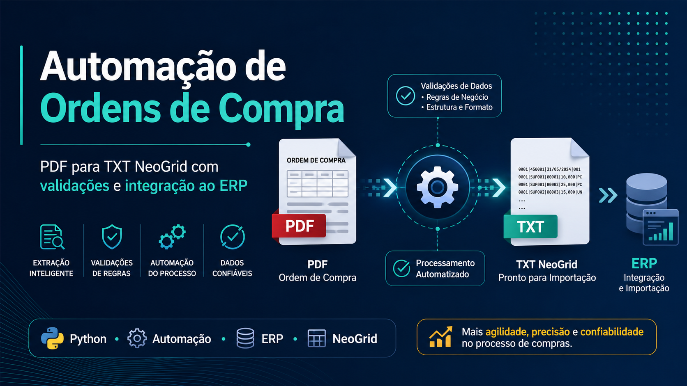

<p align="center">
  
</p>

<h1 align="center">Automacao de Ordens de Compra</h1>

<p align="center">
  Conversao automatica de ordens de compra em PDF para arquivos TXT posicionais aceitos pela importacao do Syscomp/NeoGrid.
</p>

<p align="center">
  
  
  
  
  
  
</p>

## Visao Geral

O projeto transforma ordens de compra em PDF em arquivos TXT posicionais usados na importacao do ERP. Hoje o fluxo cobre:

1. leitura de um ou mais PDFs
2. extracao do texto com `pdfplumber`
3. parser de cabecalho, itens, totais e multiplas OCs no mesmo PDF
4. cruzamento com a planilha oficial de De/Para
5. aplicacao de regras de conversao comercial
6. enriquecimento com dados oficiais do Syscomp via Firebird ODBC
7. validacoes de negocio e de estrutura
8. geracao do TXT final
9. salvamento de relatorios operacionais
10. processamento automatico no servidor Windows

A solucao foi montada para reduzir digitacao manual, padronizar conversoes, bloquear pedidos inconsistentes e deixar rastreabilidade completa do processamento.

## O Que O Projeto Entrega

| Etapa | Entrega |
| --- | --- |
| Extracao | Leitura de PDFs com `pdfplumber` |
| Parser | Interpretacao de uma ou mais OCs no mesmo PDF |
| De/Para | Busca exata e aproximada na planilha oficial |
| Conversoes | Ajuste de quantidade, embalagem, multiplo e valor |
| ERP | Enriquecimento com cadastro oficial do Syscomp |
| Validacao | Bloqueio por item nao atendido, nao encontrado, revisao, divergencia e dados ERP incompletos |
| Saida | TXT posicional + relatorios Excel |
| Operacao | Execucao manual, em lote e automatica no servidor Windows |

## Fluxo Resumido

```text
PDF da OC
  -> extrair_pdf.py
  -> parser_oc.py
  -> tratar_duplicatas.py
  -> produtos_depara.py
  -> relatorio_processamento.py
  -> syscomp_db.py
  -> validar_txt.py
  -> gerar_txt_neogrid.py
  -> TXT + relatorios + movimentacao do PDF
```

## Estrutura Do Projeto

```text
silo-automacao/
|- assets/
|- README.md
|- requirements.txt
|- .gitignore
|- rodar_automacao_oc.bat
|- data/
|  |- entrada/
|  |  \- ordens_pdf/
|  |- saida/
|  |  |- txt_gerados/
|  |  \- relatorios/
|  |- apoio/
|  |  |- Tabela de produtos.xlsx
|  |  |- NeoGrid PEDIDOS.pdf
|  |  \- _backup/
|  \- exemplos/
|- docs/
|- scripts/
|  \- build_modelo_operacional_produtos.py
|- src/
|  |- auto_processar_pasta.py
|  |- config.py
|  |- extrair_pdf.py
|  |- gerar_txt_neogrid.py
|  |- main.py
|  |- parser_oc.py
|  |- produtos_depara.py
|  |- relatorio_processamento.py
|  |- syscomp_db.py
|  |- tratar_duplicatas.py
|  \- validar_txt.py
\- tests/
```

## Arquivos E Bases Necessarias

Arquivos principais da operacao:

- PDFs das ordens de compra
- `Tabela de produtos.xlsx`
- `NeoGrid PEDIDOS.pdf`
- acesso ao banco Firebird do Syscomp

Arquivos e pastas mais importantes:

- entrada de PDFs: `data/entrada/ordens_pdf`
- tabela oficial: `data/apoio/Tabela de produtos.xlsx`
- layout de referencia: `data/apoio/NeoGrid PEDIDOS.pdf`
- TXTs gerados: `data/saida/txt_gerados`
- relatorios: `data/saida/relatorios`

## Instalacao

### 1. Clone o repositorio

```bash
git clone https://github.com/RenanDobriansky/Silo-Automa-o-de-Or-amentos.git
cd Silo-Automa-o-de-Or-amentos
```

### 2. Crie o ambiente virtual

```powershell
python -m venv .venv
.\.venv\Scripts\Activate.ps1
```

### 3. Instale as dependencias

```powershell
python -m pip install --upgrade pip
python -m pip install -r requirements.txt
```

Dependencias atuais:

- `pandas`
- `openpyxl`
- `pdfplumber`
- `rapidfuzz`
- `python-dotenv`
- `pyodbc`
- `pytest`

## Execucao Local

### Processar um PDF

```powershell
python -m src.main "data/entrada/ordens_pdf/ordem_compra.pdf"
```

### Processar uma pasta inteira

```powershell
python -m src.main "data/entrada/ordens_pdf"
```

### Rodar o runner automatico manualmente

```powershell
python -m src.auto_processar_pasta
```

### Rodar os testes

```powershell
pytest
```

## Integracao Com O Syscomp

O projeto continua usando o PDF como origem da OC e a planilha como De/Para, mas o TXT final passa a usar dados oficiais do ERP sempre que necessario.

Fluxo atual:

1. extrai a OC do PDF
2. identifica o item interno pela planilha
3. consulta o Syscomp em lote pelos `COD. SILO`
4. anexa ao relatorio os dados oficiais do cadastro
5. usa esses dados para montar o TXT

Campos ja considerados nessa integracao:

- codigo do produto
- descricao curta
- descricao para o TXT
- NCM
- codigo de barras oficial
- unidade
- codigo RMS
- referencia do produto

Variaveis de ambiente da conexao:

```env
FIREBIRD_HOST=26.75.223.88
FIREBIRD_PORT=3050
FIREBIRD_DATABASE=C:\syscomp\gdb\SILO.FDB
FIREBIRD_USER=SYSDBA
FIREBIRD_PASSWORD=laranja
FIREBIRD_CHARSET=UTF8
SYSCOMP_EMPRESA=001
```

Tambem e possivel usar:

- `FIREBIRD_DSN`
- `SYSCOMP_ODBC_DSN`

## Planilha Oficial De Produtos

A planilha oficial fica em `data/apoio/Tabela de produtos.xlsx` e hoje funciona como base operacional para a equipe.

Colunas mais importantes:

- `Ativo`
- `Status Item`
- `Prioridade`
- `Data inicio`
- `Data fim`
- `Item`
- `COD. SILO`
- `Codigo de Barras`
- `DESCRICAO`
- `CONVERSAO`
- `Observacao`

Abas da planilha:

- `cadastro_produtos`
- `instrucoes`
- `observacoes_rapidas`

Script de apoio para montar ou reconstruir esse arquivo:

```powershell
python scripts/build_modelo_operacional_produtos.py
```

Esse script:

- gera o modelo operacional
- atualiza o arquivo oficial
- aproveita os relatorios ja existentes
- tenta preencher codigo de barras a partir do relatorio do Syscomp
- cria backup automatico em `data/apoio/_backup`

## Regras Do De/Para

O cruzamento principal e feito pela coluna `Item`.

Comportamento atual:

- primeiro tenta correspondencia exata por `item_normalizado`
- se nao encontrar, tenta correspondencia aproximada com `rapidfuzz`
- retorna `COD. SILO`, `DESCRICAO`, regra de conversao e metadados da linha escolhida
- quando houver mais de uma linha ativa para o mesmo item, a maior `Prioridade` vence

Isso permite trocar um codigo antigo por um novo sem apagar historico, apenas desativando a linha antiga e mantendo a nova como vigente.

## Status Possiveis Dos Itens

### Status do De/Para

| Status | Significado |
| --- | --- |
| `encontrado_exato` | item localizado com correspondencia direta |
| `encontrado_aproximado` | item localizado com score aceitavel |
| `revisar` | existe semelhanca, mas exige conferencia humana |
| `nao_encontrado` | item nao localizado com seguranca |
| `nao_atendido` | item esta registrado, mas a empresa nao atende |

### Status do enriquecimento ERP

| Status | Significado |
| --- | --- |
| `ok` | produto localizado no Syscomp com dados suficientes |
| `pendente_syscomp` | codigo nao retornou do banco |
| `dados_incompletos` | cadastro ERP ainda nao tem os campos obrigatorios |
| `nao_aplicado` | item nao entrou na etapa automatica |

O TXT so pode ser gerado quando todos os itens automaticos estiverem consistentes nas duas camadas.

## Tratamento De Duplicatas

O modulo `src/tratar_duplicatas.py` prepara a planilha antes do processamento.

Regras principais:

- remove duplicatas exatas automaticamente
- normaliza `Item`, `COD. SILO` e `DESCRICAO`
- cria `item_normalizado`
- separa conflitos reais para revisao

Relatorios gerados:

- `produtos_unicos.xlsx`
- `produtos_duplicados_para_revisao.xlsx`

## Conversoes Comerciais

O projeto ja cobre regras comerciais especificas da operacao, incluindo arredondamento sempre para cima quando a venda no ERP ocorre por embalagem fechada ou multiplo minimo.

Exemplos de regras ja implementadas:

- caixas fechadas por quantidade minima
- docinhos por caixa de `50`, `150` e `160`
- guardanapos por multiplo de fardo
- Fibraco Verde Grosso por multiplo de `10`
- filmes PVC com conversao comercial especifica
- Farinha de Rosca em pacote fechado de `5KG`

Exemplos praticos:

- `130` unidades com regra `50` vira `3` caixas
- `151` doces com regra `150` vira `2` caixas
- `90` guardanapos com multiplo `72` vira `144`
- `13` Fibraco Verde Grosso com multiplo `10` vira `20`
- `12 KG` de Farinha de Rosca vira `3` pacotes de `5KG`

Quando a unidade comercial muda, o valor unitario tambem e ajustado para a unidade final usada no ERP.

## Geracao Do TXT

O modulo `src/gerar_txt_neogrid.py` hoje gera um flat file posicional no formato homologado para importacao no Syscomp.

Registros atualmente montados:

- `019`
- `024`
- `040`
- `090`

Caracteristicas dessa geracao:

- cada registro tem tamanho fixo por tipo
- os campos sao montados por schema posicional
- valores numericos sao formatados para o layout
- o codigo do produto prioriza o codigo de barras oficial quando disponivel
- a gravacao bloqueia caracteres invalidos e dados obrigatorios ausentes

## Relatorios Gerados

Saidas operacionais mais importantes:

| Tipo | Local | Nome esperado |
| --- | --- | --- |
| TXT final | `data/saida/txt_gerados` | `OC_<numero_oc>.txt` |
| Relatorio de conversao | `data/saida/relatorios` | `relatorio_conversao_OC_<numero_oc>.xlsx` |
| Relatorio de duplicatas | `data/saida/relatorios` | `produtos_unicos.xlsx` e `produtos_duplicados_para_revisao.xlsx` |
| Relatorio de codigo de barras | `data/saida/relatorios` | `produtos_status_codigo_barras_syscomp.xlsx` ou derivados |

## Validacoes Atuais

Antes e depois da geracao do TXT, o pipeline valida:

- itens `revisar`
- itens `nao_encontrado`
- itens `nao_atendido`
- totais da OC
- dados obrigatorios vindos do Syscomp
- estrutura minima do TXT
- tamanho dos registros

## Operacao No Servidor Windows

O projeto ja esta rodando no servidor com agendamento automatico.

Raiz operacional suportada:

- via UNC remoto: `\\Servidor\arquivos rede\AUTOMACAO OC`
- via caminho local do servidor: `C:\ARQUIVOS REDE\AUTOMACAO OC`

Na pratica, o caminho ativo depende da variavel:

- `AUTOMACAO_OC_ROOT`

Pastas operacionais:

- `entrada`
- `processando`
- `processados`
- `erro`
- `saida\txt_gerados`
- `saida\relatorios`
- `apoio`
- `logs`

Protecoes operacionais implementadas:

- lock para impedir concorrencia simultanea
- validacao de arquivo ainda em copia
- quantidade configuravel de leituras estaveis
- limpeza de TXT parcial em falha
- diferenciacao entre erro tecnico e erro de negocio
- arquivamento do PDF processado pelo numero da OC

Variaveis operacionais:

- `AUTOMACAO_OC_ROOT`
- `AUTOMACAO_OC_READY_CHECK_INTERVAL_SECONDS`
- `AUTOMACAO_OC_READY_STABLE_CHECKS`

## Execucao Pelo Agendador

A operacao automatica do servidor usa o arquivo [rodar_automacao_oc.bat](rodar_automacao_oc.bat).

Esse `.bat` faz:

- define a raiz operacional
- ajusta os parametros de checagem de arquivo em copia
- navega ate a pasta do projeto
- ajusta o `PYTHONPATH`
- executa o runner automatico
- grava log complementar do agendador

Exemplo central:

```bat
set "AUTOMACAO_OC_ROOT=C:\ARQUIVOS REDE\AUTOMACAO OC"
set "AUTOMACAO_OC_READY_CHECK_INTERVAL_SECONDS=1.5"
set "AUTOMACAO_OC_READY_STABLE_CHECKS=2"
cd /d C:\Projetos\silo-automacao
set "PYTHONPATH=C:\Projetos\silo-automacao\src"
call C:\Projetos\silo-automacao\.venv\Scripts\python.exe -m auto_processar_pasta
```

## Testes

Rodar a suite:

```powershell
pytest
```

A cobertura atual inclui:

- extracao de PDF
- parser de OC
- tratamento de duplicatas
- De/Para de produtos
- enriquecimento Syscomp
- relatorio de conversao
- validacao do TXT
- geracao do TXT
- fluxo principal
- configuracao do servidor
- runner automatico

## Documentacao

Documentos principais desta etapa:

- [guia_implantacao_operacao_servidor.md](docs/guia_implantacao_operacao_servidor.md)
- [desenho_tecnico_automacao_servidor.md](docs/desenho_tecnico_automacao_servidor.md)
- [agendamento_windows_automacao_oc.md](docs/agendamento_windows_automacao_oc.md)
- [checklist_homologacao_automacao_oc.md](docs/checklist_homologacao_automacao_oc.md)
- [prompts_etapa_automacao_servidor.md](docs/prompts_etapa_automacao_servidor.md)
- [resumo_andamento_projeto.md](docs/resumo_andamento_projeto.md)

## Estado Atual

Em 31 de julho de 2026, o projeto ja cobre:

- operacao automatica no servidor
- enriquecimento do TXT com dados do Syscomp
- controle operacional por planilha oficial
- revisao de codigo de barras
- regras comerciais criticas de conversao

Os proximos refinamentos tendem a ficar concentrados em:

- homologacao fina do TXT com o ERP
- ajustes de mapeamento por fornecedor ou familia
- manutencao da base operacional da planilha
- evolucao dos relatorios de apoio

## Observacoes Importantes

- a qualidade da planilha oficial continua sendo decisiva para o sucesso do processo
- itens marcados como `Nao atendido` devem bloquear a geracao automatica
- itens sem codigo de barras oficial no ERP podem impedir a importacao no sistema
- a camada Syscomp reduz dependencia de preenchimento manual para dados oficiais do cadastro
- novas regras comerciais devem ser ajustadas preferencialmente em `src/produtos_depara.py`
